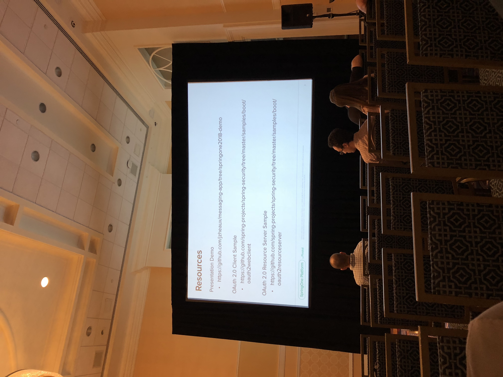

# Spring Security in 5.1 with OAuth
spring-boot-starter-security
spring-security-oauth2-resorce-server
* Declares jwt encoded bearer tokens

``` yml
security:
  oauth2:
    resourceserver:
      jwt: 
        issuer-uri: http://localhost:8090/uaa/oauth/token
```

## Useful Resource Server Endpoints
http://localhost:8090/uaa/oauth/token/.well-known/openid-configuration
/uaa/token_keys

ROLE_ used for authorities or SCOPE_

WebClient only, no RestTemplates

``` java
new ServletOAuth2AuthorizedClientExchangeFilterFunction(clientRedistrationRepository, someThing)

WebClient.builder()
.applu(oauth2.oauth2Configuration)
.build();
```
## Server customization

GrantedAuthoritiesExtractor




